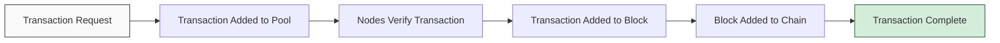

## What is Blockchain Technology?

Blockchain technology is a decentralized, distributed ledger that records transactions across multiple computers. This ensures that the record cannot be altered retroactively without the alteration of all subsequent blocks and the consensus of the network.

> Blockchain is not just about cryptocurrency; it's a foundational technology that can transform how we handle data, establish trust, and conduct transactions.
{: .prompt-tip }

### Key Components of Blockchain

1. **Blocks** - Containers for data
2. **Chain** - Connects blocks in chronological order
3. **Nodes** - Distributed network computers maintaining the blockchain
4. **Consensus Mechanisms** - Methods for validating transactions

## How Does Blockchain Work?

The process can be visualized with this simplified flow:



### The Hashing Process

Cryptographic hashing is fundamental to blockchain security. A hash function converts input data of any size to a fixed-size output. In blockchain, this looks like:

```
Block 1 Data + Hash(0) = Hash(1)
Block 2 Data + Hash(1) = Hash(2)
Block 3 Data + Hash(2) = Hash(3)
```

The mathematical relationship can be represented as:

$$H(B_n) = H(B_{n-1} + \text{Data} + \text{Nonce})$$

Where:
- $H$ is the hash function
- $B_n$ is the current block
- $B_{n-1}$ is the previous block
- Nonce is a number used once to find a valid hash

## Popular Blockchain Applications

| Application | Description | Notable Examples |
|:------------|:------------|:-----------------|
| Cryptocurrencies | Digital currencies operating on blockchain | Bitcoin, Ethereum, Solana |
| Smart Contracts | Self-executing contracts with terms directly written into code | Ethereum, Cardano, Polkadot |
| Supply Chain | Tracking goods from production to delivery | VeChain, IBM Blockchain |
| Identity Management | Secure digital identity solutions | Civic, SelfKey |
| Voting Systems | Secure and transparent electoral systems | Voatz, Follow My Vote |

## Challenges in Blockchain Technology

Despite its potential, blockchain faces several challenges:

```
- Scalability issues
- Energy consumption concerns
- Regulatory uncertainty
- Integration with existing systems
- User adoption barriers
```
{: .nolineno }

> Warning: While blockchain offers many benefits, it's not a solution for every problem. Careful evaluation is needed before implementation.
{: .prompt-warning }

## The Future of Blockchain

Blockchain technology continues to evolve with promising developments:

1. **Layer 2 Solutions** - Addressing scalability issues
2. **Cross-Chain Interoperability** - Allowing different blockchains to communicate
3. **Sustainable Consensus Mechanisms** - Reducing energy consumption
4. **Mainstream Integration** - Adoption by traditional institutions

## Code Example: Simple Blockchain in JavaScript

Here's a simplified implementation of a blockchain in JavaScript:

```javascript
class Block {
  constructor(index, timestamp, data, previousHash = '') {
    this.index = index;
    this.timestamp = timestamp;
    this.data = data;
    this.previousHash = previousHash;
    this.hash = this.calculateHash();
    this.nonce = 0;
  }

  calculateHash() {
    return SHA256(
      this.index + 
      this.previousHash + 
      this.timestamp + 
      JSON.stringify(this.data) + 
      this.nonce
    ).toString();
  }

  mineBlock(difficulty) {
    while (this.hash.substring(0, difficulty) !== Array(difficulty + 1).join("0")) {
      this.nonce++;
      this.hash = this.calculateHash();
    }
    console.log("Block mined: " + this.hash);
  }
}

class Blockchain {
  constructor() {
    this.chain = [this.createGenesisBlock()];
    this.difficulty = 4;
  }

  createGenesisBlock() {
    return new Block(0, "01/01/2023", "Genesis Block", "0");
  }

  getLatestBlock() {
    return this.chain[this.chain.length - 1];
  }

  addBlock(newBlock) {
    newBlock.previousHash = this.getLatestBlock().hash;
    newBlock.mineBlock(this.difficulty);
    this.chain.push(newBlock);
  }

  isChainValid() {
    for (let i = 1; i < this.chain.length; i++) {
      const currentBlock = this.chain[i];
      const previousBlock = this.chain[i - 1];

      if (currentBlock.hash !== currentBlock.calculateHash()) {
        return false;
      }

      if (currentBlock.previousHash !== previousBlock.hash) {
        return false;
      }
    }
    return true;
  }
}
```

## Conclusion

Blockchain technology represents a fundamental shift in how we create trust in digital environments. As the technology matures, we can expect to see more innovative applications across various industries and sectors.

Are you interested in learning more about specific blockchain applications or development? Share your thoughts in the comments below.

## References

1. Nakamoto, S. (2008). *Bitcoin: A Peer-to-Peer Electronic Cash System*
2. Buterin, V. (2014). *Ethereum: A Next-Generation Smart Contract and Decentralized Application Platform*
3. Antonopoulos, A. M. (2017). *Mastering Bitcoin: Programming the Open Blockchain* 