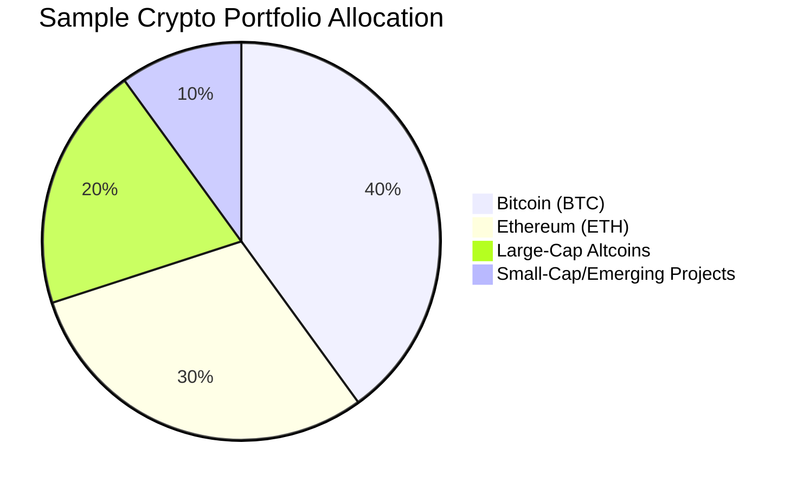

## The Evolving Cryptocurrency Landscape

As we progress through 2024, the cryptocurrency market continues to mature, presenting both opportunities and challenges for investors. This post explores practical investment strategies designed to navigate the current crypto landscape.

> Always remember: Cryptocurrency investments involve significant risk. Never invest more than you can afford to lose.
{: .prompt-warning }

## Key Investment Strategies

### 1. Strategic Diversification

Diversification remains crucial in crypto investing:



### 2. Dollar-Cost Averaging (DCA)

Rather than timing the market, consider investing fixed amounts at regular intervals:

$$\text{Average Cost} = \frac{\text{Total Investment}}{\text{Total Coins Purchased}}$$

### 3. Risk Management Framework

| Risk Level | Strategy | Portfolio % |
|:-----------|:---------|:------------|
| Conservative | Blue-chip crypto assets (BTC, ETH) | 70-80% |
| Moderate | Established altcoins with utility | 15-25% |
| Aggressive | Emerging projects with potential | 5-10% |

## Technical Analysis Fundamentals

For active traders, these indicators provide valuable insights:

1. **Moving Averages** - Identifying trend direction
2. **Relative Strength Index (RSI)** - Measuring overbought/oversold conditions
3. **MACD (Moving Average Convergence Divergence)** - Spotting momentum shifts
4. **Volume Analysis** - Confirming price movements

## Fundamental Analysis Checklist

```
- Project utility and real-world applications
- Development team background and experience
- Tokenomics and supply distribution
- Adoption metrics and active users
- Partnership quality and strategic alliances
- Regulatory compliance measures
```
{: .nolineno }

## Emerging Trends Worth Watching

1. **Layer 2 Scaling Solutions** - Enhancing transaction speed and reducing costs
2. **DeFi 2.0 Protocols** - Advanced financial instruments on blockchain
3. **Regulated Crypto Products** - ETFs and institutional investment vehicles
4. **Web3 Infrastructure** - Supporting the decentralized internet ecosystem
5. **Regenerative Finance (ReFi)** - Blockchain solutions for environmental challenges

## Tax Considerations

> Different jurisdictions have varying tax regulations for crypto. Consult with a tax professional familiar with digital assets in your region.
{: .prompt-tip }

## Building Your Investment Strategy

The most successful crypto investors typically:

1. Set clear investment goals and time horizons
2. Maintain adequate fiat reserves for contingencies
3. Regularly rebalance portfolios as market conditions change
4. Stay informed through quality research sources
5. Practice emotional discipline during market volatility

## Conclusion

As cryptocurrency markets continue to evolve in 2024, a balanced approach combining cautious optimism with rigorous research will serve investors well. By implementing these strategies and maintaining discipline, you can navigate the complexity of digital asset investing with greater confidence.

What investment strategy has worked best for your crypto portfolio? Share your experiences in the comments below. 