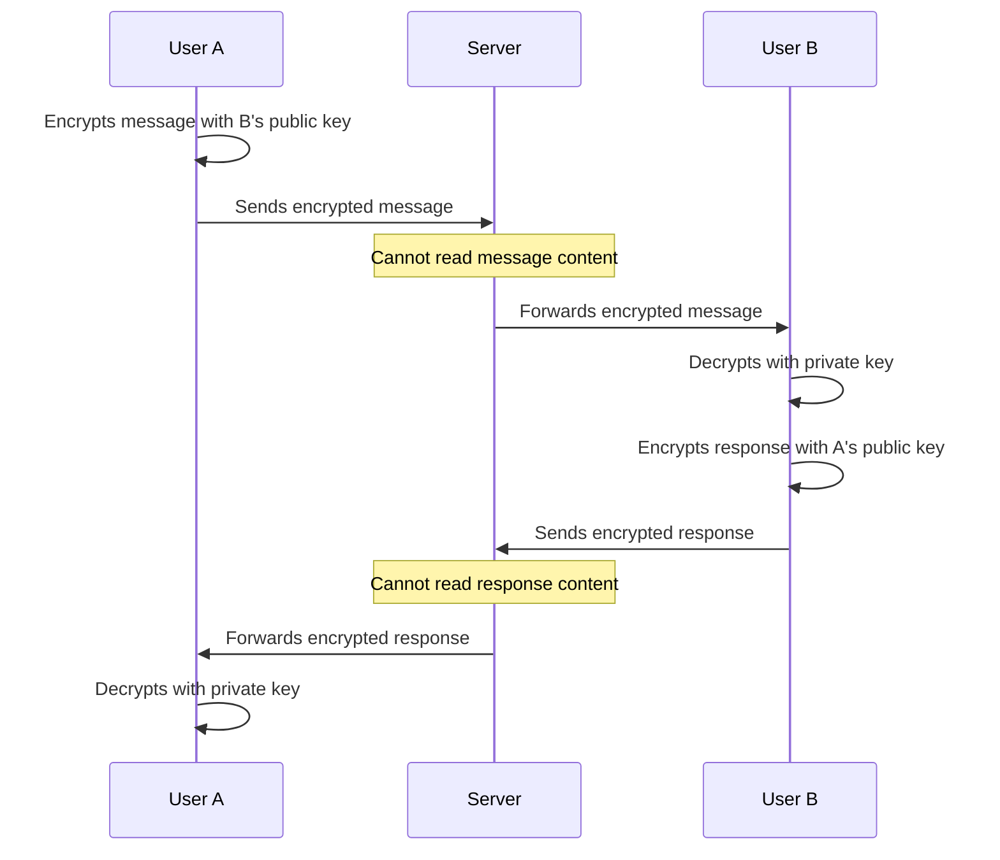
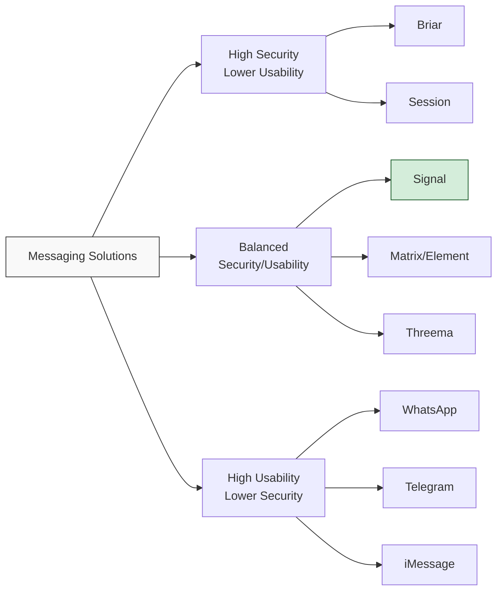

## The Importance of Secure Messaging

In an era of mass surveillance and data breaches, secure messaging has become essential for protecting our private communications. This post examines the leading secure messaging solutions, their underlying protocols, and the privacy guarantees they provide.

> Privacy in communication is not about having something to hide, but about having something worth protecting.
{: .prompt-info }

## Understanding Encryption in Messaging

### End-to-End Encryption (E2EE)

End-to-end encryption ensures that only the communicating users can read the messages. No intermediary—not even the service provider—can access the content:



### Key Security Properties

1. **Forward Secrecy** - Past messages remain secure even if keys are compromised
2. **Post-Compromise Security** - Future messages become secure after a compromise
3. **Metadata Protection** - Limiting what data about communications is collected
4. **Identity Verification** - Ensuring you're communicating with the intended recipient

## Top Secure Messaging Apps

| App | Protocol | E2EE | Open Source | Metadata Collection | Notable Features |
|:----|:---------|:-----|:------------|:--------------------|:-----------------|
| Signal | Signal Protocol | Yes | Yes | Minimal | Disappearing messages, Sealed sender |
| Element/Matrix | Matrix (Olm/Megolm) | Yes | Yes | Configurable | Decentralized, Self-hosting option |
| Threema | Custom (NaCl) | Yes | Partial | Minimal | Anonymous use without phone number |
| WhatsApp | Signal Protocol | Yes | No | Extensive | Wide adoption, Multi-device |
| Wire | Proteus | Yes | Yes | Moderate | Team collaboration features |
| Session | Session Protocol | Yes | Yes | None | Onion routing, No phone required |
| Briar | Custom (BRP) | Yes | Yes | None | P2P, works without internet |

### Signal: The Gold Standard

Signal has become the reference implementation for secure messaging:

1. **Protocol Innovation** - Developed the double ratchet algorithm
2. **Minimal Metadata** - Collects only phone number and last connection time
3. **Security Features** - Disappearing messages, view-once media, sealed sender
4. **Usability Focus** - Familiar interface similar to traditional messaging apps
5. **Independent Foundation** - Non-profit with transparent funding

> The Signal Protocol has been adopted by WhatsApp, Facebook Messenger, and Google Messages, bringing E2EE to billions of users.
{: .prompt-tip }

### Matrix: Decentralized Communications

Matrix offers a federated approach to secure messaging:

```
- Open standard protocol supporting decentralization
- Self-hosting option for complete control
- Bridges to other messaging platforms
- Rich ecosystem of clients (Element, FluffyChat, etc.)
- Strong community governance and development
```
{: .nolineno }

## Technical Deep Dive: Encryption Protocols

### The Signal Protocol Architecture

Signal's protocol uses a combination of:

1. **Extended Triple Diffie-Hellman (X3DH)** - For initial key exchange
2. **Double Ratchet Algorithm** - For message encryption with forward secrecy
3. **Prekeys** - Allowing asynchronous message initiation
4. **SHA-256 HMAC** - For message authentication

### OMEMO (XMPP) vs Olm/Megolm (Matrix)

Both protocols address multi-device E2EE but differ in approach:

| Feature | OMEMO | Olm/Megolm |
|:--------|:------|:-----------|
| Base Protocol | Signal-derived | Custom (Signal-inspired) |
| Group Chat Efficiency | Lower | Higher (Megolm) |
| Forward Secrecy | Yes | Yes (with caveats in groups) |
| Implementation Complexity | Higher | Moderate |
| Formal Verification | No | Yes (Olm) |

## Privacy Considerations Beyond Encryption

### Metadata Collection

Encrypted content is only one aspect of messaging privacy:

1. **Contact Discovery** - How servers discover which contacts use the service
2. **Social Graph** - Whether the provider can map your relationships
3. **IP Address Logging** - Reveals user location and activity patterns
4. **Message Timing/Frequency** - Can reveal communication patterns
5. **Group Membership** - Information about which users communicate together

### Anonymous Signup Options

| App | Phone Number Required | Email Option | Anonymous Use |
|:----|:----------------------|:-------------|:--------------|
| Signal | Yes | No | No |
| Element/Matrix | No | Yes | Yes (self-hosting) |
| Threema | No | No | Yes (paid) |
| WhatsApp | Yes | No | No |
| Session | No | No | Yes |
| Briar | No | No | Yes |

## Making the Right Choice

### Threat Model Considerations

Choose your messaging app based on your specific needs:

1. **General Privacy** - Signal, WhatsApp (convenience vs. privacy balance)
2. **High Security Needs** - Signal, Threema, Session
3. **Protection from Service Providers** - Matrix (self-hosted), Briar
4. **Avoiding Phone Number Linkage** - Matrix, Session, Threema
5. **Censorship Resistance** - Briar, Session

### Usability vs. Security Trade-offs



## Best Practices for Secure Messaging

1. **Verify Security Codes/Keys** - Confirm the identity of your contacts
2. **Keep Apps Updated** - Ensure you have the latest security patches
3. **Use Disappearing Messages** - Minimize message retention where appropriate
4. **Screen Security** - Enable screen security options to prevent screenshots
5. **Secure Your Device** - A compromised device undermines all messaging security
6. **Multiple Apps Strategy** - Different apps for different communication needs

## Conclusion

The landscape of secure messaging continues to evolve, with each solution offering different trade-offs between security, privacy, and usability. Signal remains the benchmark for most users, balancing strong security with usability, while alternatives like Matrix, Threema, and Session offer specialized features for specific privacy needs.

Ultimately, the best secure messaging app depends on your personal threat model, technical comfort level, and which apps your contacts are willing to use. The good news is that strong encryption is becoming the norm rather than the exception in modern messaging.

What secure messaging app do you trust with your communications? Share your experiences in the comments below. 