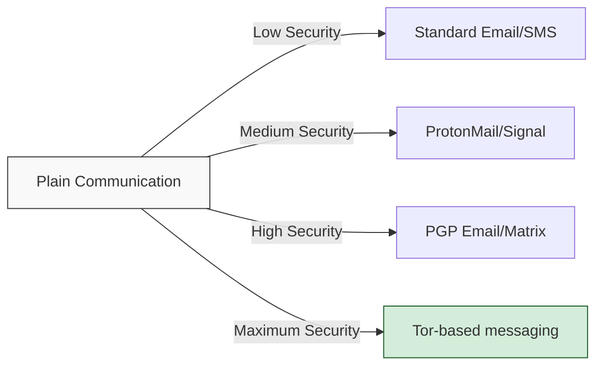

## The Privacy Paradox

In today's hyperconnected world, we face a fundamental contradiction: while sharing more of our personal information than ever before, we simultaneously desire greater privacy. This post explores essential tools and strategies to help reconcile this paradox and reclaim control over your digital identity.

> Privacy is not about having something to hide. It's about having something to protect.
{: .prompt-info }

## The Privacy Toolkit

### Secure Browsing

| Tool | Purpose | Key Features |
|:-----|:--------|:-------------|
| Firefox + Hardening | Privacy-focused browser | Customizable privacy settings, Extensions support |
| Brave | Privacy browser | Built-in ad/tracker blocking, HTTPS upgrading |
| Tor Browser | Anonymous browsing | Onion routing, No browsing history |
| LibreWolf | Hardened Firefox fork | Stripped telemetry, Enhanced security defaults |

### Communication Security



### VPN Solutions

When selecting a VPN, consider these critical factors:

1. **Jurisdiction** - Outside 14-Eyes surveillance alliance
2. **Logging Policy** - Verified no-logs policy
3. **Technical Security** - OpenVPN or WireGuard protocols
4. **Privacy Features** - Kill switch, DNS leak protection
5. **Payment Options** - Cryptocurrency payment support

> Warning: A VPN is not a complete anonymity solution. It should be part of a layered approach to privacy.
{: .prompt-warning }

## Data Protection Essentials

```
- Full-disk encryption (VeraCrypt, LUKS, FileVault)
- Password managers (KeePassXC, Bitwarden)
- Metadata cleaners (MAT2, ExifTool)
- Secure file deletion tools (BleachBit, secure-delete)
- E2E encrypted cloud storage (Cryptomator, Tresorit)
```
{: .nolineno }

## System Hardening

### Operating System Choices

1. **Linux Distributions**
   - Qubes OS (Compartmentalization)
   - Tails OS (Amnesic live system)
   - Whonix (Tor implementation)
   - Linux Mint/Ubuntu (Beginner-friendly options)

2. **Mobile Security**
   - GrapheneOS (Android privacy focus)
   - CalyxOS (Privacy with usability)
   - LineageOS (De-Googled Android)
   - iOS with hardened settings

## Threat Modeling

Before implementing privacy tools, develop a personal threat model by asking:

1. What information are you protecting?
2. Who might want this information?
3. How much effort are they willing to expend?
4. What are the consequences if they succeed?
5. What countermeasures make sense for this threat level?

## Practical Privacy Implementation

### Daily Privacy Practices

- Use strong, unique passwords with a password manager
- Enable 2FA wherever possible (preferably with hardware keys)
- Regularly audit app permissions and data sharing
- Compartmentalize digital activities by purpose
- Consider email aliases for different services

### Advanced Techniques

- Network traffic analysis prevention
- Browser fingerprinting resistance
- Hardware security keys implementation
- Air-gapped computing for sensitive operations
- Metadata minimization strategies

## Balancing Privacy and Convenience

Remember that perfect privacy often trades off against convenience. Establish a sustainable approach by:

1. Identifying your highest-value privacy concerns
2. Implementing strong protection for those areas
3. Making reasonable compromises where appropriate
4. Gradually increasing your privacy posture over time

## Conclusion

Digital privacy isn't about pursuing perfect anonymity or paranoia—it's about making informed choices about your personal information. By implementing these tools and strategies, you can significantly reduce your digital footprint and protect your most sensitive data from unnecessary exposure.

What privacy tools have you found most effective in your daily digital life? Share your experiences in the comments. 