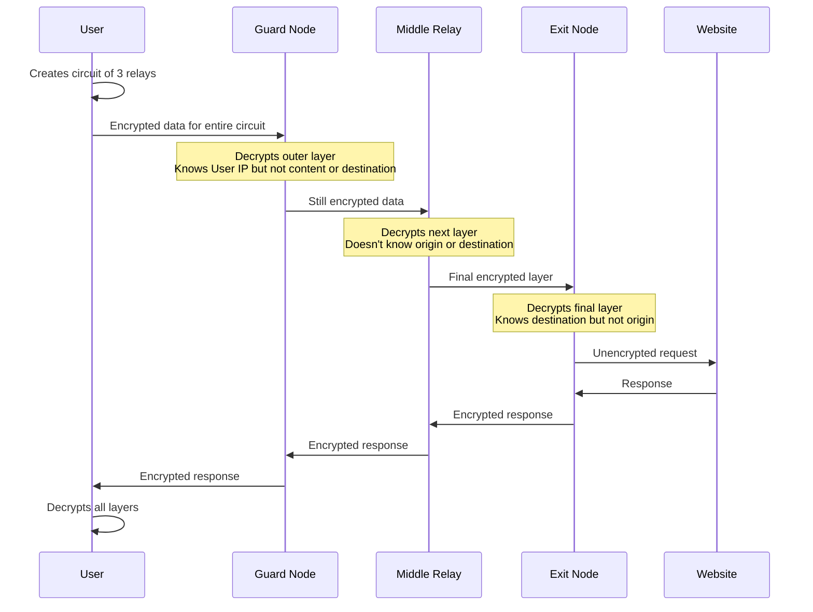
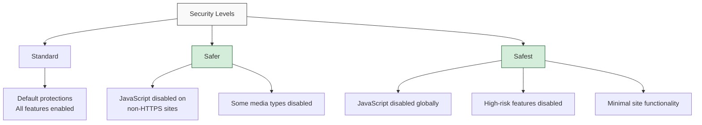

## Understanding the Tor Network

The Tor (The Onion Router) network provides privacy and anonymity by routing your internet traffic through multiple servers, encrypting it in layers, and making it difficult to trace communications back to their source. Originally developed by the U.S. Naval Research Laboratory, Tor is now maintained by the nonprofit Tor Project.

> Tor provides privacy, not security. It helps protect your identity and location, but doesn't automatically encrypt all your communications or protect you from malware.
{: .prompt-warning }

## How Tor Works: The Technical Foundations



### The Three-Relay Circuit

Tor provides anonymity through a three-hop architecture:

1. **Guard Node** - The entry point that knows your IP but not your destination
2. **Middle Relay** - Passes encrypted data without knowing source or destination
3. **Exit Node** - The final relay that connects to the destination website

This separation ensures that no single relay knows both who you are and what you're accessing.

## Setting Up Tor Properly

### Tor Browser Installation

For most users, Tor Browser provides the simplest and most secure way to access the Tor network:

1. **Download** - Always obtain Tor Browser from the official website (torproject.org)
2. **Verify** - Check the cryptographic signatures to confirm authenticity
3. **Install** - Follow platform-specific instructions for your operating system
4. **Update** - Keep Tor Browser updated to the latest version automatically

### Advanced Configurations

| Configuration | Use Case | Security Level |
|:--------------|:---------|:---------------|
| Bridges | Censored networks where Tor is blocked | Medium-High |
| Pluggable Transports | Disguising Tor traffic patterns | High |
| Tor over VPN | Additional IP obfuscation layer | Medium-High |
| VPN over Tor | Hiding Tor usage from ISP | Medium |
| Tails OS | Maximum anonymity, leaves no traces | Very High |

```
# Example torrc configuration for using bridges
UseBridges 1
ClientTransportPlugin obfs4 exec /usr/bin/obfs4proxy
Bridge obfs4 X.X.X.X:YYYY FINGERPRINT
```
{: .nolineno }

## Security Best Practices

### Essential Security Settings

Tor Browser's security settings can be adjusted based on your threat model:



### Avoiding Common Mistakes

The following mistakes can compromise your anonymity:

1. **Browser Maximization** - Keeping Tor Browser at its default size prevents fingerprinting
2. **Mixing Identities** - Never use personal accounts while using Tor
3. **Downloading Files** - Opening documents can reveal your real IP address
4. **Installing Extensions** - Additional browser add-ons can create unique fingerprints
5. **Tor Over Tor** - Running Tor inside another Tor connection can degrade anonymity

> One of the most common mistakes is assuming Tor makes you completely anonymous. Your behavior and choices while using Tor are just as important as the technology itself.
{: .prompt-info }

## Advanced Tor Usage

### Understanding .onion Services

Onion services (formerly "hidden services") provide additional privacy benefits:

- End-to-end encryption without exit nodes
- Hidden server location and identity
- Resistance to censorship and DDoS attacks
- No reliance on the traditional certificate authority system

### Verifying .onion Addresses

Always verify .onion addresses through multiple trusted sources:

```
# Example of legitimate .onion addresses (as of 2024)
New York Times: nytimesn7cgmftshazwhfgzm37qxb44r64ytbb2dj3x62d2lljsciiyd.onion
DuckDuckGo: duckduckgogg42xjoc72x3sjasowoarfbgcmvfimaftt6twagswzczad.onion
ProtonMail: protonmailrmez3lotccipshtkleegetolb73fuirgj7r4o4vfu7ozyd.onion
```
{: .nolineno }

### Tor Limitations and Vulnerabilities

Understanding Tor's limitations is essential for effective use:

1. **Exit Node Monitoring** - Exit nodes can see unencrypted traffic
2. **Correlation Attacks** - Timing and traffic analysis by global adversaries
3. **Browser Exploits** - JavaScript vulnerabilities can deanonymize users
4. **Operational Security Failures** - User behavior often reveals identity
5. **Malicious Nodes** - Some Tor relays may be operated by attackers

## Tor for Different Use Cases

### Censorship Circumvention

For users in restricted environments:

1. **Bridge Configuration** - Use unlisted relays to access the Tor network
2. **Pluggable Transports** - Obfs4, Snowflake, or meek to disguise Tor traffic
3. **Alternative Bootstrapping** - Methods to obtain bridges when websites are blocked
4. **Fallback Strategies** - Secondary circumvention tools if Tor is inaccessible

### Journalism and Research

For researchers and journalists:

```
- Use SecureDrop for secure document submission
- Combine Tor with secure communication tools
- Maintain separate research identities
- Use Tails OS for sensitive investigations
- Practice compartmentalization of activities
```
{: .nolineno }

## Common Issues and Troubleshooting

### Connectivity Problems

If you're having trouble connecting to Tor:

1. Check your computer's time and date settings
2. Try using bridges if direct connections are blocked
3. Verify firewall settings aren't blocking Tor
4. Check if your network is actively filtering Tor traffic
5. Try alternate bootstrapping methods

### Performance Optimization

To improve Tor performance:

1. **Circuit Selection** - Create a new circuit for better performance
2. **Entry Guards** - Allow time for stable guard selection
3. **Browser Settings** - Adjust security levels appropriately
4. **Traffic Management** - Avoid bandwidth-intensive applications
5. **Connection Timing** - Use Tor during less congested periods

## The Broader Tor Ecosystem

### Supporting Projects and Tools

Several tools complement Tor's functionality:

1. **Tails OS** - Amnesic live system routing all traffic through Tor
2. **Whonix** - VM-based operating system for advanced Tor usage
3. **OnionShare** - Secure file sharing over the Tor network
4. **Tor Metrics** - Statistics about the Tor network's performance
5. **Snowflake** - Browser-based bridge helping censored users

### Contributing to the Tor Network

Support Tor's privacy mission by:

- Running a relay or bridge to expand network capacity
- Reporting bugs and vulnerabilities responsibly
- Donating to the Tor Project and related initiatives
- Participating in usability testing and translation
- Educating others about proper Tor usage

## Conclusion

The Tor network provides a valuable tool for privacy, anonymity, and censorship resistance when used correctly. By understanding its technical foundations, following security best practices, and recognizing its limitations, you can maximize the protection Tor offers while minimizing potential risks.

Remember that Tor is just one component of a comprehensive privacy strategy. Combining Tor with appropriate operational security practices, encryption tools, and a clear understanding of your specific threat model will provide the strongest protection for your digital privacy.

Have you encountered any challenges while using Tor? Share your experiences or questions in the comments below. 