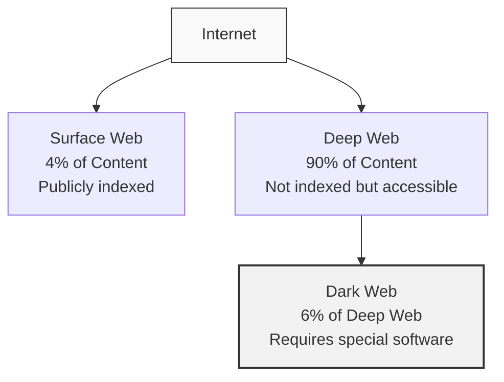

## Understanding the Dark Web

The dark web represents a part of the internet that requires specialized software to access and isn't indexed by standard search engines. Often misunderstood and sensationalized in media, this post aims to provide a balanced perspective on what the dark web actually is and how it operates.

> The dark web isn't inherently illegal or malicious—it's a neutral technology that can be used for both legitimate and illegitimate purposes.
{: .prompt-info }

## The Internet's Three Layers



### The Surface Web
What most people use daily—websites accessible through standard browsers and indexed by search engines like Google.

### The Deep Web
Content not indexed by search engines but accessible through standard browsers—includes private email accounts, online banking, subscription services, and more.

### The Dark Web
A small portion of the deep web that requires specialized software, configurations, or authorization to access.

## How the Dark Web Works

### Onion Routing Technology

The Tor (The Onion Router) network forms the backbone of dark web access:

1. **Multiple Encryption Layers** - Data is encrypted multiple times
2. **Node Routing** - Traffic passes through at least three relay nodes
3. **Decentralized Architecture** - No single point of failure
4. **.onion Domains** - Special top-level domain for dark web sites

```
Client → Guard Node → Middle Relay → Exit Node → Destination
    ↑                                             ↓
    └─────────────────Response─────────────────────┘
```
{: .nolineno }

## Legitimate Uses of the Dark Web

| Use Case | Description | Examples |
|:---------|:------------|:---------|
| Privacy Protection | Avoiding surveillance and tracking | Journalists, political dissidents |
| Secure Communication | Protected messaging in sensitive situations | Whistleblowers, activists |
| Censorship Circumvention | Accessing information in restricted regions | Citizens in authoritarian regimes |
| Academic Research | Studying hidden networks and communities | Security researchers, sociologists |
| Anonymous Publishing | Sharing sensitive information safely | Leak platforms, freedom of speech |

## Dark Web Risks and Concerns

> Warning: Accessing the dark web without proper knowledge and precautions can expose you to various risks, including legal consequences.
{: .prompt-warning }

### Security Threats

1. **Malware Distribution** - Higher concentration of malicious software
2. **Phishing Operations** - Sophisticated identity theft attempts
3. **Exit Node Vulnerabilities** - Potential for traffic monitoring
4. **Operational Security Failures** - User errors revealing identity

### Illegal Activities

The dark web does host marketplaces and forums for illegal goods and services, including:

- Illicit substance trading
- Stolen data and credentials
- Counterfeit documents and currency
- Hacking services and malware

## Accessing the Dark Web Safely

If you have legitimate reasons to access the dark web, follow these precautions:

1. **Use a Security-Focused OS** - Tails or Whonix provide additional protection
2. **Keep Software Updated** - Always run the latest Tor Browser version
3. **Disable JavaScript** - Reduces attack surface for browser exploits
4. **Use VPN with Tor** - Adds additional privacy layer (controversial; research first)
5. **Never Share Personal Information** - Maintain strict separation of identities

## Common Misconceptions

```
- Myth: The dark web is much larger than the surface web
  Fact: The dark web is a tiny fraction of the deep web

- Myth: Simply accessing the dark web is illegal
  Fact: Using Tor and similar technologies is legal in most countries

- Myth: The dark web is only used by criminals
  Fact: It serves many legitimate privacy and security purposes

- Myth: The dark web is completely anonymous
  Fact: User mistakes and advanced techniques can deanonymize users
```
{: .nolineno }

## The Future of the Dark Web

As surveillance technologies advance and regulatory frameworks evolve, the dark web continues to adapt:

1. **Enhanced Security Protocols** - Improving anonymity technologies
2. **Increasing Mainstream Adoption** - Growing privacy concerns driving usage
3. **Law Enforcement Advancement** - More sophisticated investigation techniques
4. **Decentralized Marketplaces** - Moving away from centralized site vulnerabilities

## Conclusion

The dark web represents a complex technological ecosystem that defies simple characterization. While it does enable criminal activity that should be condemned, it also provides essential tools for privacy, freedom of speech, and protection against surveillance—particularly for vulnerable populations living under oppressive regimes.

Understanding the nuanced reality of the dark web helps us move beyond sensationalist headlines toward a more informed perspective on its role in digital privacy and security.

Have you encountered common misconceptions about the dark web? Share your thoughts in the comments below. 