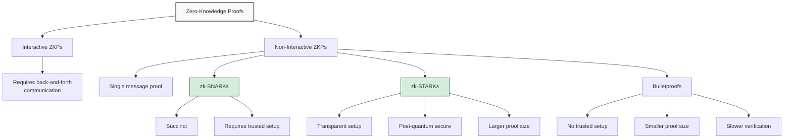

## Understanding Zero-Knowledge Proofs

Zero-knowledge proofs (ZKPs) represent one of cryptography's most powerful innovations, allowing one party (the prover) to convince another party (the verifier) that a statement is true without revealing any information beyond the validity of the statement itself.

> In essence, zero-knowledge proofs allow you to prove you know a secret without revealing the secret itself.
{: .prompt-info }

## The Mathematical Foundation

At their core, ZKPs rely on complex mathematical constructs, but the concept can be understood through three fundamental properties:

1. **Completeness**: If the statement is true, an honest verifier will be convinced by an honest prover.
2. **Soundness**: If the statement is false, no cheating prover can convince an honest verifier that it is true (except with negligible probability).
3. **Zero-knowledge**: The verifier learns nothing beyond the validity of the statement.

These properties can be expressed mathematically as:

$$P(x,w) \Rightarrow V(x) \approx 1$$

Where $P$ is the prover with a witness $w$ to the truth of statement $x$, and $V$ is the verifier who accepts with high probability.

## Types of Zero-Knowledge Proofs



### The Evolution of ZKP Systems

| ZKP System | Trusted Setup | Proof Size | Verification Time | Post-Quantum Security |
|:-----------|:--------------|:-----------|:------------------|:----------------------|
| zk-SNARKs | Required | Very small (~200 bytes) | Very fast | No |
| zk-STARKs | Not required | Larger (~50-100 KB) | Fast | Yes |
| Bulletproofs | Not required | Medium (~2 KB) | Slower | No |
| PLONK | Universal (one-time) | Small (~600 bytes) | Fast | No |

## Real-World Applications

### Privacy-Preserving Blockchains

ZKPs enable privacy on transparent blockchains:

1. **Shielded Transactions** - Hide transaction amounts and addresses (Zcash, Monero)
2. **Private Smart Contracts** - Execute contracts without revealing inputs or state (Aleo, Aztec)
3. **Compliance Mechanisms** - Prove regulatory compliance without revealing underlying data

### Identity and Authentication

ZKPs revolutionize digital identity:

```
- Prove age without revealing birthdate
- Verify credit score without revealing financial history
- Authenticate ownership without revealing private keys
- Demonstrate citizenship without exposing personal information
```
{: .nolineno }

### Blockchain Scaling Solutions

ZKPs power some of the most promising Layer 2 scaling solutions:

> Zero-knowledge rollups can increase blockchain throughput by orders of magnitude while inheriting the security of the base layer.
{: .prompt-tip }

**ZK-Rollups Architecture:**

1. **Transaction Batching** - Multiple transactions grouped together
2. **Off-Chain Computation** - State transitions computed outside main chain
3. **Validity Proofs** - ZKP verifying correctness of all transactions
4. **State Updates** - Compressed results published to main chain

## The Technical Implementation

### A Simple ZKP Example: The Ali Baba Cave

Consider this classic ZKP illustration:

1. Peggy (prover) knows the secret word to open a door connecting two paths in a circular cave.
2. Victor (verifier) wants proof Peggy knows the word without learning it.
3. Victor waits outside while Peggy enters the cave.
4. Victor calls out which exit path Peggy should use to leave.
5. If Peggy knows the secret, she can always exit as requested.
6. Repeating this process multiple times makes the probability Peggy is cheating negligibly small.

This demonstrates zero-knowledge because Victor learns only that Peggy knows the secret, not what the secret is.

### Building ZKP Systems

Modern ZKP systems typically involve:

1. **Circuit Design** - Representing computation as arithmetic circuits
2. **Polynomial Commitments** - Efficient representation of large data
3. **Elliptic Curve Cryptography** - Foundation for most ZKP constructions
4. **Multi-Party Computation** - For secure trusted setup ceremonies

## Challenges and Limitations

```
- Computational complexity for proof generation
- Trusted setup requirements for some systems
- Developer usability and tooling limitations
- Proving general computations efficiently
- Integration with existing systems
```
{: .nolineno }

## The Future of Zero-Knowledge Technology

As ZKP technology evolves, several trends are emerging:

### Technical Advancements

1. **Recursive Proofs** - ZKPs that verify other ZKPs, enabling compounding systems
2. **Universal Setups** - One-time ceremonies creating parameters for any circuit
3. **Hardware Acceleration** - Specialized equipment for faster proof generation
4. **Modular Proving Systems** - Composable ZKP components for specific applications

### Emerging Applications

- **Private DeFi** - Financial applications with transaction privacy
- **Decentralized Identity** - Self-sovereign identity with selective disclosure
- **Enterprise Data Sharing** - Verifiable computation across organizational boundaries
- **Gaming and Metaverse** - Provable in-game achievements and properties

## Conclusion

Zero-knowledge proofs represent a paradigm shift in how we think about data privacy and verification. By enabling the validation of information without revealing the information itself, ZKPs address the fundamental tension between transparency and privacy that has characterized the digital age.

As the technology continues to mature, we can expect zero-knowledge systems to play an increasingly central role in blockchain scaling, privacy-preserving applications, and secure verification processes across numerous domains.

Have you encountered applications of zero-knowledge proofs in your work or research? Share your experiences in the comments below. 