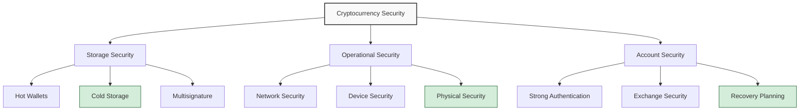

## The Critical Importance of Cryptocurrency Security

With the total cryptocurrency market capitalization now in the trillions of dollars, digital assets have become an attractive target for attackers. Unlike traditional financial systems, cryptocurrency transactions are irreversible, pseudonymous, and offer no central authority for recourse if funds are stolen or lost.

> The responsibility for cryptocurrency security falls entirely on the individual. There are no password resets or fraud departments in decentralized finance.
{: .prompt-danger }

## The Security Hierarchy



## Wallet Security Best Practices

### Types of Wallets

| Wallet Type | Security Level | Convenience | Best For |
|:------------|:---------------|:------------|:---------|
| Hardware Wallets | Highest | Medium | Long-term holdings |
| Paper Wallets | High | Low | Cold storage |
| Metal Seed Storage | Highest | Low | Disaster-proof backup |
| Software Wallets | Medium | High | Regular transactions |
| Mobile Wallets | Medium-Low | Highest | Small amounts/daily use |
| Exchange Wallets | Low | Highest | Active trading only |

### Hardware Wallet Security

Hardware wallets like Ledger, Trezor, and Coldcard provide maximum security by:

1. **Keeping Private Keys Offline** - Keys never leave the device
2. **Requiring Physical Verification** - Transactions need manual confirmation
3. **Providing Malware Resistance** - Purpose-built firmware resistant to attacks
4. **Supporting Recovery Seeds** - 12-24 word phrases for wallet recovery

## Advanced Security Configurations

### Multisignature Setups

Multisignature (multisig) wallets require multiple keys to authorize transactions:

```
Standard transaction: 1-of-1 key required
Multisig transaction: M-of-N keys required (e.g., 2-of-3, 3-of-5)
```
{: .nolineno }

Benefits include:
- Protection against single points of failure
- Distribution of trust among multiple devices/locations
- Elimination of single-person attack vectors
- Support for inheritance and succession planning

### Tiered Storage Approach

Implement a tiered approach based on holdings:

1. **Hot Wallet** - Small amounts for daily transactions
2. **Warm Storage** - Medium amounts in software wallets with 2FA
3. **Cold Storage** - Majority of assets in hardware/paper wallets
4. **Deep Cold Storage** - Large holdings in multisig/geographically distributed setups

## Operational Security (OpSec)

```
- Never share private keys or seed phrases digitally
- Avoid discussing holdings in public forums or social media
- Use dedicated devices for high-value transactions
- Verify receiving addresses through multiple channels
- Monitor blockchain explorers for unexpected transactions
- Use encrypted communication for crypto discussions
```
{: .nolineno }

> The most sophisticated wallet setup can be compromised by a simple phishing attack or malware infection. Technical and behavioral security must work together.
{: .prompt-warning }

## Common Attack Vectors and Mitigations

### Phishing Attacks

Attackers create convincing imitations of legitimate services to steal credentials and private keys.

**Mitigations:**
- Bookmark official websites instead of using search engines
- Verify SSL certificates and domain names carefully
- Never click on cryptocurrency links from emails or messages
- Use hardware wallets that show and verify receiving addresses

### SIM Swapping

Attackers gain control of phone numbers to bypass SMS-based 2FA and reset account credentials.

**Mitigations:**
- Use authentication apps instead of SMS for 2FA
- Apply a PIN or password to your mobile account
- Consider using a dedicated phone number for financial services
- Implement email address compartmentalization

## Recovery Planning

### Seed Phrase Protection

Your seed phrase is the master key to your cryptocurrency:

1. **Physical Security** - Store on metal/paper in waterproof, fireproof location
2. **Redundancy** - Create multiple copies in different secure locations
3. **Consideration of Threats** - Plan for fire, flood, theft, and personal incapacitation
4. **Inheritance Planning** - Ensure trusted individuals can access funds if needed

### Testing Recovery Procedures

Regularly test your recovery process:
- Restore wallets from seed phrases
- Practice multisig recovery scenarios
- Verify inherited access procedures

## Conclusion

Cryptocurrency security requires a comprehensive approach combining technical tools with consistent security practices. By implementing these strategies—and regularly updating your security posture as technology evolves—you can significantly reduce the risk of loss and theft while maintaining reasonable access to your digital assets.

What security practices have you implemented for your cryptocurrency holdings? Share your experiences (without specific details of your setup) in the comments below. 