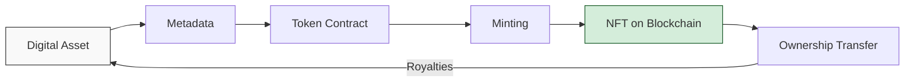

## Understanding NFTs: Beyond the Hype

Non-Fungible Tokens (NFTs) represent a fundamental shift in how we establish and verify ownership of digital assets. While early headlines focused on multi-million dollar art sales, the true significance of NFTs lies in their ability to bring scarcity, provenance, and transferable ownership rights to the digital realm.

> NFTs solve the 'infinite copy problem' that has defined digital media since its inception.
{: .prompt-info }

## How NFTs Work: The Technical Foundation

At their core, NFTs are unique digital tokens created ("minted") on blockchains that support smart contract functionality. Each token contains:

1. **A Unique Identifier** - Distinguished from every other token
2. **Ownership Information** - Recorded on the blockchain
3. **Token Metadata** - Points to the digital asset and its details
4. **Smart Contract Rules** - Defines transferability and royalties



## The NFT Ecosystem

### Popular NFT Categories

| Category | Description | Notable Examples |
|:---------|:------------|:-----------------|
| Digital Art | Original artwork in digital form | Beeple's "Everydays", Art Blocks |
| Collectibles | Digital trading cards and collectibles | CryptoPunks, Bored Ape Yacht Club |
| Virtual Real Estate | Land parcels in virtual worlds | Decentraland, The Sandbox |
| Gaming Assets | In-game items with true ownership | Axie Infinity, Gods Unchained |
| Music & Media | Songs, albums, and video content | 3LAU's Ultraviolet, Kings of Leon NFTs |
| Identity & Credentials | Verifiable credentials and memberships | ENS Domains, POAPs |

### The Marketplace Landscape

NFT marketplaces serve as the primary trading venues, with platforms specializing in different niches and offering various features:

```
- General marketplaces (OpenSea, Rarible)
- Curated platforms (Foundation, SuperRare)
- Game-specific markets (Axie Marketplace)
- Music-focused platforms (Sound.xyz, Royal)
- Virtual real estate (Decentraland Marketplace)
```
{: .nolineno }

## Beyond Digital Art: Practical Applications

While digital art captured early attention, NFTs have far-reaching applications:

### Intellectual Property and Licensing

NFTs can represent ownership or usage rights for patents, copyrights, and other intellectual property. Smart contracts can automate licensing and royalty payments, creating more transparent and efficient IP markets.

### Real-World Asset Tokenization

Physical assets can be represented and fractionalized through NFTs:

1. **Real Estate** - Property ownership divided into tradable tokens
2. **Collectibles** - Authentication and provenance for physical items
3. **Event Tickets** - Verifiable, transferable access rights
4. **Luxury Goods** - Certificates of authenticity with ownership history

### Identity and Credentials

NFTs offer powerful solutions for digital identity:

- **Educational Credentials** - Verifiable degrees and certifications
- **Membership Access** - Transferable club or service memberships
- **Professional Licenses** - Verifiable professional qualifications
- **Attendance Verification** - Proof of presence at events or meetings

## Challenges in the NFT Space

> The NFT ecosystem still faces significant challenges that must be addressed for mainstream adoption.
{: .prompt-warning }

### Environmental Concerns

Early NFTs on Ethereum faced criticism for energy consumption. The ecosystem is responding through:

- Transition to Proof of Stake consensus mechanisms
- Layer-2 scaling solutions reducing transaction footprints
- Carbon offset programs for NFT platforms and collections

### Technical Limitations

Several technical issues remain unsolved:

1. **Asset Storage** - Most NFTs point to assets stored on centralized servers
2. **Metadata Permanence** - Changes to metadata can alter what the NFT represents
3. **Smart Contract Vulnerabilities** - Coding flaws can lead to theft or loss
4. **Interoperability Issues** - Limited standards across platforms and chains

## The Future of NFTs

As the technology matures, several trends are emerging:

### Evolution of Utility

NFTs are evolving beyond simple ownership tokens to include:

- **Dynamic NFTs** - Tokens that change based on external conditions
- **Composable NFTs** - Assets that can interact with other digital objects
- **Experience-based NFTs** - Tokens that unlock real-world experiences
- **Programmable NFTs** - Assets with complex embedded functionality

### Integration with Traditional Industries

Traditional sectors are beginning to incorporate NFT technology:

1. **Fashion** - Digital wearables and authentication for luxury items
2. **Real Estate** - Fractional ownership and streamlined transactions
3. **Entertainment** - Royalty distribution and fan engagement
4. **Supply Chain** - Product authenticity and provenance tracking

## Conclusion

NFTs represent a profound shift in how we conceptualize and implement digital ownership. While early implementations and hype cycles have had their excesses, the fundamental innovation—enabling verifiable scarcity and transferable rights in the digital domain—has potentially transformative implications for numerous industries.

As the technology matures beyond speculation toward utility, NFTs may become an invisible but essential part of our digital infrastructure, much as the underlying technologies of the internet have become today.

What applications of NFTs do you find most promising? Share your thoughts in the comments below. 