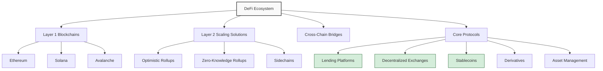

## The DeFi Paradigm Shift

Decentralized Finance, or DeFi, represents a fundamental reimagining of financial services through blockchain technology. Built primarily on smart contract platforms like Ethereum, DeFi removes traditional financial intermediaries, creating permissionless, transparent, and programmable financial systems accessible to anyone with an internet connection.

> DeFi doesn't just improve existing financial systems—it creates entirely new financial primitives that were previously impossible.
{: .prompt-info }

## The DeFi Ecosystem Architecture



## Core DeFi Components

### Decentralized Exchanges (DEXs)

Unlike traditional exchanges, DEXs operate without centralized order books or custodians:

| DEX Model | Mechanism | Examples | Trade-offs |
|:----------|:----------|:---------|:-----------|
| Automated Market Makers | Liquidity pools with pricing algorithms | Uniswap, Curve | Higher slippage, impermanent loss |
| Order Book DEXs | On-chain or hybrid order books | dYdX, Serum | More complex, higher gas costs |
| Aggregators | Source liquidity from multiple DEXs | 1inch, ParaSwap | Extra complexity, better pricing |

### Lending and Borrowing

Lending protocols enable permissionless borrowing and lending of crypto assets:

1. **Overcollateralized Loans** - Borrowers deposit collateral exceeding loan value
2. **Interest Rate Models** - Algorithmically adjusted based on utilization
3. **Liquidation Mechanisms** - Automatic liquidation when collateral value drops

The lending process can be mathematically modeled as:

$$\text{Health Factor} = \frac{\text{Collateral Value} \times \text{Liquidation Threshold}}{\text{Borrowed Value}}$$

Where a Health Factor < 1 triggers liquidation.

### Stablecoins

Stablecoins provide price stability within the volatile crypto ecosystem:

```
- Fiat-collateralized (USDC, USDT)
- Crypto-overcollateralized (DAI)
- Algorithmic (partial collateralization or purely algorithmic)
- Commodity-backed (PAXG, DGX)
```
{: .nolineno }

## DeFi Innovations and Primitives

### Yield Optimization

DeFi introduced novel ways to generate returns on crypto assets:

- **Liquidity Mining** - Providing liquidity to protocols and earning governance tokens
- **Yield Aggregators** - Automatically shifting capital to highest-yielding strategies
- **Leveraged Yield Farming** - Borrowing assets to increase farming positions

### Derivatives and Synthetics

Blockchain-based derivatives enable exposure to any asset:

1. **Synthetic Assets** - Tokenized exposure to real-world assets
2. **Options Protocols** - Decentralized options creation and trading
3. **Perpetual Swaps** - Futures-like contracts without expiration dates
4. **Prediction Markets** - Betting on outcomes of future events

### Composability: "Money Legos"

DeFi's greatest innovation may be composability—the ability for protocols to seamlessly integrate with each other:

> DeFi protocols can be combined like Lego blocks, creating complex financial products from simple components.
{: .prompt-tip }

## DeFi Risks and Challenges

### Security Vulnerabilities

```
- Smart contract exploits and logic flaws
- Oracle manipulations and failures
- Economic attacks (flash loans, MEV)
- Governance attacks and centralization risks
- Frontend attacks and phishing
```
{: .nolineno }

### Regulatory Uncertainty

DeFi faces evolving regulatory challenges:

1. **Securities Regulations** - Determining which tokens are securities
2. **KYC/AML Compliance** - Balancing permissionless access with compliance
3. **Jurisdictional Questions** - Determining which laws apply to borderless protocols
4. **DAO Governance Liability** - Legal status of decentralized organizations

## The Future of DeFi

### Institutional Adoption

As DeFi matures, institutional participation is increasing through:

- Regulated DeFi platforms with compliance solutions
- Institutional-grade custody and security
- Integration with traditional finance systems (TradFi)
- Hybrid CeFi/DeFi applications

### Real-World Asset Tokenization

The tokenization of traditional assets represents a major frontier:

1. **Real Estate** - Fractional ownership of properties on-chain
2. **Private Equity** - Tokenized shares in private companies
3. **Commodities** - Digital ownership of physical goods
4. **Revenue Streams** - Tokenized cash flows from businesses

## DeFi Analytics and Metrics

| Metric | Description | Current State |
|:-------|:------------|:--------------|
| Total Value Locked (TVL) | Total assets locked in DeFi protocols | $50B+ across chains |
| Daily Active Users | Unique addresses interacting with DeFi | Growing steadily |
| Transaction Volume | Value transferred through DeFi | Competing with some traditional exchanges |
| Protocol Revenue | Fees generated by DeFi protocols | Demonstrating sustainable models |

## Conclusion

Decentralized Finance represents one of blockchain technology's most compelling use cases, creating financial infrastructure that is permissionless, transparent, and programmable. While challenges remain, particularly around security, scalability, and regulation, DeFi's fundamental innovations are likely to significantly influence the future of financial services.

As the traditional and decentralized financial worlds continue to converge, we're witnessing the emergence of a more accessible, efficient, and inclusive global financial system—one that combines the best elements of both paradigms.

Have you participated in DeFi protocols? What has your experience been with this emerging financial system? Share your thoughts in the comments below. 