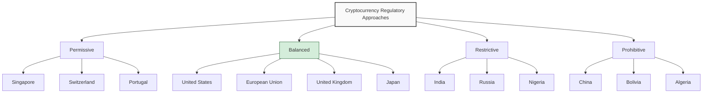
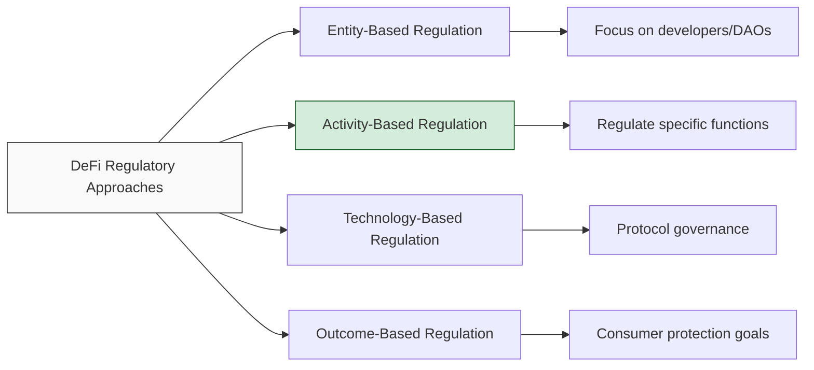

## The Evolving Regulatory Landscape

As cryptocurrencies have moved from niche technology to mainstream financial instruments, regulatory frameworks worldwide have evolved to address their unique characteristics. This post examines the current state of crypto regulations across major jurisdictions and offers insights into compliance strategies.

> The regulatory environment for cryptocurrencies is dynamic and complex. This article provides general information, not legal advice. Always consult with qualified legal professionals for your specific situation.
{: .prompt-warning }

## Major Regulatory Approaches



## Regulatory Framework by Region

### North America

#### United States

The U.S. has a complex, multi-regulator approach:

1. **Securities and Exchange Commission (SEC)** - Regulates crypto assets deemed securities
2. **Commodity Futures Trading Commission (CFTC)** - Oversees crypto derivatives and certain spot markets
3. **Financial Crimes Enforcement Network (FinCEN)** - Enforces AML/CFT requirements
4. **Office of Foreign Assets Control (OFAC)** - Administers sanctions compliance
5. **State Regulators** - Issue money transmitter licenses (e.g., New York's BitLicense)

Recent regulatory developments include:

- Spot Bitcoin ETF approvals
- Enhanced enforcement against unregistered securities offerings
- Stablecoin legislative proposals
- Increased scrutiny of DeFi platforms

#### Canada

Canada has established a registration framework for crypto trading platforms and clear tax treatment of cryptocurrencies.

### European Union

The EU has implemented comprehensive crypto regulations:

| Regulation | Focus | Implementation Timeline |
|:-----------|:------|:------------------------|
| MiCA (Markets in Crypto-Assets) | Comprehensive framework for crypto issuance and service providers | Phased from 2024-2025 |
| TFR (Transfer of Funds Regulation) | Travel rule implementation for crypto transfers | 2024 |
| DAC8 | Crypto tax reporting requirements | 2026 |
| AMLD6 | Anti-money laundering requirements | 2025 |

### Asia-Pacific

The region shows diverse approaches:

```
- Japan: Progressive licensing system for crypto exchanges
- Singapore: Risk-based regulatory framework with clear guidelines
- South Korea: Strong KYC/AML requirements with gaming restrictions
- Australia: Exchange registration and AML compliance
- Hong Kong: Opt-in licensing for exchanges serving retail
```
{: .nolineno }

## Key Regulatory Focus Areas

### AML/CFT Compliance

Anti-Money Laundering and Countering the Financing of Terrorism regulations generally require:

1. **Customer Due Diligence** - Identifying and verifying customer identities
2. **Enhanced Due Diligence** - Additional verification for high-risk customers
3. **Suspicious Activity Reporting** - Monitoring and reporting suspicious transactions
4. **Travel Rule Compliance** - Information sharing for transfers between VASPs
5. **Sanctions Screening** - Checking against government sanction lists

### Taxation

Cryptocurrency tax treatment varies by jurisdiction but typically includes:

- **Capital Gains Tax** - Applied when selling or exchanging crypto
- **Income Tax** - For mining, staking rewards, and certain DeFi yields
- **Value-Added Tax/Sales Tax** - For goods/services purchased with crypto
- **Reporting Requirements** - Mandatory disclosure of holdings and transactions

> Tax reporting requirements have become more stringent globally, with automated information exchange between tax authorities becoming the norm.
{: .prompt-info }

### Securities Regulations

The classification of cryptocurrencies as securities remains contentious:

1. **Securities Tests** - Different jurisdictions apply various tests (e.g., Howey Test in the US)
2. **Token Categories** - Payment tokens, utility tokens, security tokens, and stablecoins
3. **Registration Requirements** - Securities offerings typically require registration or exemption
4. **Secondary Market Trading** - Trading platforms for security tokens need appropriate licenses

## Special Regulatory Categories

### Stablecoins

Stablecoins face increasing regulatory scrutiny:

- **Reserve Requirements** - Mandates for backing assets and transparency
- **Prudential Standards** - Capital and liquidity requirements
- **Systemic Risk Concerns** - Potential designation as systemically important
- **Consumer Protection** - Redemption rights and disclosure obligations

### DeFi (Decentralized Finance)

Regulators are grappling with DeFi supervision:



### Central Bank Digital Currencies (CBDCs)

Many jurisdictions are developing CBDCs that will interact with private cryptocurrencies:

1. **Retail vs. Wholesale Models** - Direct consumer access or financial institution-focused
2. **Privacy Considerations** - Balancing surveillance capabilities with privacy rights
3. **Programmability** - Potential for programmable money with conditional transfers
4. **Interoperability** - Integration with existing payment systems and cross-border functionality

## Compliance Strategies

### For Individuals

```
- Maintain detailed transaction records
- Use compliant exchanges and services
- Understand tax obligations in your jurisdiction
- Consider tax software specific to cryptocurrencies
- Disclose holdings where legally required
- Seek professional advice for complex situations
```
{: .nolineno }

### For Businesses

1. **Regulatory Mapping** - Identify applicable regulations across operating jurisdictions
2. **Compliance Program** - Develop robust KYC/AML procedures and policies
3. **Technology Solutions** - Implement transaction monitoring and compliance tools
4. **Legal Expertise** - Engage specialized legal counsel for cryptocurrency matters
5. **Proactive Engagement** - Participate in regulatory consultations and dialogue
6. **Industry Standards** - Adopt self-regulatory best practices

## Future Regulatory Trends

As we look ahead to the remainder of 2025 and beyond, several regulatory trends are emerging:

1. **Harmonization Efforts** - Greater international coordination of regulatory approaches
2. **DeFi-Specific Frameworks** - Tailored regulations for decentralized financial services
3. **Privacy Coin Scrutiny** - Increased restrictions on privacy-enhancing cryptocurrencies
4. **Environmental Concerns** - Potential regulations addressing crypto's carbon footprint
5. **Financial Stability Focus** - Regulations aimed at limiting systemic risks
6. **Consumer Protection Emphasis** - Stronger disclosure and conduct requirements

## Conclusion

The cryptocurrency regulatory landscape continues to evolve as governments seek to balance innovation with consumer protection, financial stability, and crime prevention. While compliance requirements are increasing, greater regulatory clarity is also emerging, potentially supporting mainstream adoption and institutional participation in the long term.

For both individuals and businesses in the cryptocurrency space, staying informed about regulatory developments and implementing robust compliance processes is essential for navigating this complex environment successfully.

What regulatory developments are you most concerned about in your jurisdiction? Share your thoughts in the comments below. 