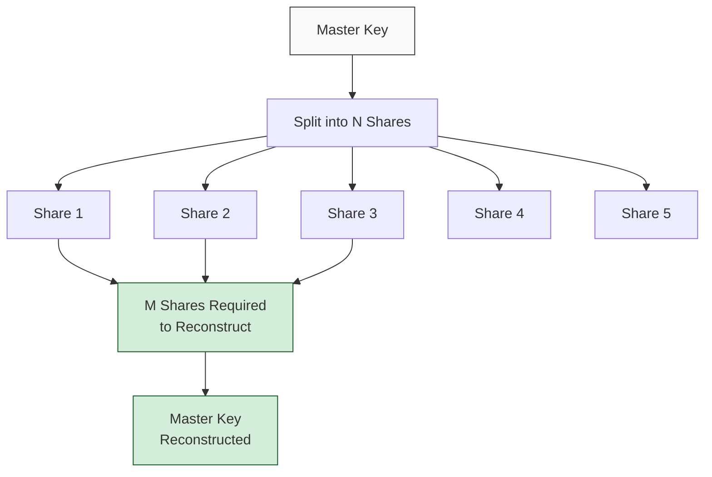

## Beyond Basic Security: Advanced Cryptocurrency Protection

While basic security practices like hardware wallets and two-factor authentication are essential starting points, those with significant holdings or specific security requirements may need to implement more robust measures. This post explores advanced security hardening techniques for cryptocurrency protection.

> These advanced techniques are intended for users with specific security requirements. They involve trade-offs between security and usability that each user must evaluate based on their own threat model.
{: .prompt-warning }

## Threat Modeling for Cryptocurrency Security

Before implementing advanced security measures, develop a comprehensive threat model:

```mermaid
flowchart TD
    A[Threat Modeling] --> B[Asset Identification]
    A --> C[Threat Identification]
    A --> D[Vulnerability Assessment]
    A --> E[Risk Analysis]
    A --> F[Countermeasure Selection]
    
    B --> B1[What cryptocurrency assets are you protecting?]
    B --> B2[What is their total value?]
    
    C --> C1[Who might target your assets?]
    C --> C2[What capabilities do they have?]
    C --> C3[What are their motivations?]
    
    D --> D1[How could your system be compromised?]
    D --> D2[What are your current security weaknesses?]
    
    E --> E1[What is the likelihood of each threat?]
    E --> E2[What is the potential impact?]
    
    F --> F1[What security measures address your specific risks?]
    F --> F2[What is the appropriate security/usability balance?]
    
    style A fill:#f9f9f9,stroke:#333,stroke-width:2px
    style F fill:#d4edda,stroke:#155724,stroke-width:1px
```



## Air-Gapped Systems

### Creating a True Air-Gapped Environment

For maximum security, completely isolate your signing environment:

1. **Dedicated Hardware** - Use a computer that has never been and will never be connected to the internet
2. **Clean Installation** - Install the OS from verified media
3. **Physical Isolation** - Remove or physically disable all networking hardware
4. **Side-Channel Protection** - Consider Faraday cage protection, air-gap monitoring
5. **Physical Security** - Secure location with appropriate access controls

### Data Transfer Methods

When working with air-gapped systems, use secure data transfer methods:

| Method | Security Level | Practicality | Considerations |
|:-------|:---------------|:-------------|:---------------|
| QR Codes | High | Medium | Limited data capacity, camera required |
| USB Drives | Medium | High | Risk of firmware malware, use carefully |
| SD Cards | Medium | High | Similar risks to USB, slightly safer |
| Offline Signing Devices | Very High | Medium | Purpose-built devices minimize attack surface |
| Paper | Very High | Low | Manual data entry, error-prone |

```
- Always treat transfer media as potentially compromised
- Verify data integrity across the air gap
- Use one-way data flow when possible
- Consider write-protected or one-time-use media
- Sanitize media after use in networked systems
```
{: .nolineno }

## Multisignature and Shamir's Secret Sharing

### Advanced Multisignature Configurations

Multisignature setups add security through distribution:

1. **Geographic Distribution** - Store keys in different physical locations
2. **Organizational Distribution** - Divide control among different trusted individuals
3. **Technological Distribution** - Use different devices and software for each key
4. **M-of-N Optimization** - Balance security vs. availability (e.g., 3-of-5, 2-of-3)

> Multisignature setups protect against single points of failure, whether from device compromise, physical disaster, or trusted party issues.
{: .prompt-tip }

### Shamir's Secret Sharing for Key Recovery

SSS provides mathematical guarantees for key recovery:



Implementation considerations:
- Use Shamir's Secret Sharing (SLIP-0039) or similar standards
- Distribute shares among trusted parties and secure locations
- Consider inheritance planning and disaster recovery scenarios
- Regularly test recovery procedures without exposing all shares simultaneously

## Key Generation Ceremonies

For maximum security, implement formal key generation ceremonies:

1. **Preparation Phase**
   - Assemble necessary hardware and verification tools
   - Prepare secure environment (air-gapped, monitored)
   - Assign roles to participants (administrators, witnesses)

2. **Ceremony Execution**
   - Generate entropy from multiple sources
   - Create master keys in secure environment
   - Distribute shares or create multisignature wallets
   - Document all steps with witnesses

3. **Post-Ceremony Procedures**
   - Secure storage of backup material
   - Destroy any transient sensitive information
   - Test recovery procedures with subset of data
   - Document verification signatures

## Hardware Security Enhancement

### Custom Hardware Wallet Firmware

Consider verified open-source firmware options:

```
- Coldcard firmware (open-source for Coldcard devices)
- Trezor firmware (can be verified and compiled from source)
- Specter DIY (completely open-source hardware wallet)
- Seedsigner (stateless signing device with verifiable code)
```
{: .nolineno }

### Hardware Security Modules (HSMs)

For institutional or very high-value setups, consider dedicated HSMs:

1. **Tamper-Evident Seals** - Physical evidence of tampering attempts
2. **Environmental Monitoring** - Detection of physical attack vectors
3. **Key Non-Exportability** - Keys cannot be extracted, even by authorized users
4. **Audit Logging** - Cryptographically verified logs of all operations
5. **Role-Based Access Control** - Granular permissions for key operations

## Operating System Security

### Hardened Operating Systems

| OS | Security Features | Best For |
|:---|:-----------------|:---------|
| Tails | Amnesic, leaves no traces | Transient operations |
| Qubes OS | Strong compartmentalization | Ongoing management |
| Whonix | Tor integration, isolation | Privacy-focused users |
| Subgraph OS | Kernel hardening, application sandboxing | General hardening |

### System Hardening Best Practices

When configuring your secure environment:

1. **Minimal Installation** - Include only necessary components
2. **Application Whitelisting** - Block execution of unauthorized programs
3. **Network Controls** - Implement strict firewall rules (or no connectivity)
4. **Disk Encryption** - Full-disk encryption with strong algorithms
5. **Regular Updates** - Security patches only, via verified channels
6. **Secure Boot** - Cryptographic verification of boot process

## Physical Security Considerations

Physical security is often the weakest link:

```
- Tamper-evident packaging for stored devices and backups
- Climate-controlled storage to prevent media degradation
- Redundant storage locations with different physical risk profiles
- Access control systems with multiple authentication factors
- Video surveillance of access and usage (with appropriate privacy controls)
- Faraday protection to mitigate electromagnetic surveillance
```
{: .nolineno }

## Recovery and Inheritance Planning

### Dead Man's Switch Mechanisms

Consider implementing time-based security measures:

1. **Cryptographic Time-Lock Puzzles** - Require computing resources over time
2. **Social Recovery Systems** - Trusted parties can recover after time threshold
3. **Commercial Dead Man's Switch Services** - Specialized crypto inheritance services
4. **Multisignature Time-Locking** - Gradual key release mechanisms

### Inheritance Documentation

Create secure but accessible documentation:

1. **Non-Technical Recovery Instructions** - Step-by-step guides for heirs
2. **Security Level Appropriate to Contents** - Balance between access and protection
3. **Regular Testing and Updates** - Ensure procedures remain valid
4. **Legal Integration** - Coordinate with traditional estate planning

## Conclusion

Advanced cryptocurrency security requires a systematic approach that considers technical, physical, and operational security measures. By implementing defense in depth—multiple layers of security controls—you can significantly reduce the risk of loss or theft while ensuring authorized access remains possible.

Remember that security exists on a spectrum, and the appropriate level depends on your specific needs, threats, and resources. The most secure system is one that you can use correctly and consistently, while still providing protection against your most likely threats.

Have you implemented any advanced security techniques for your cryptocurrency holdings? Share your experiences (without specific details of your setup) in the comments below. 