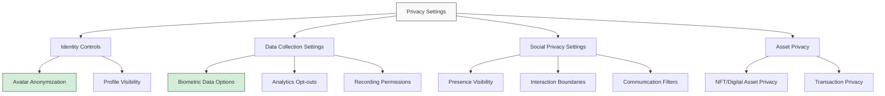

## The Metaverse Privacy Paradox

As metaverse platforms evolve from early prototypes to sophisticated digital ecosystems, they promise unprecedented immersion and connectivity—but at what cost to our privacy? These virtual worlds collect more intimate data than traditional digital platforms, creating new privacy challenges that require thoughtful consideration.

> In the metaverse, you are not just sharing your opinions or photos—you're sharing your movements, biometric data, spatial environment, and potentially even your neural responses.
{: .prompt-warning }

## Understanding Metaverse Data Collection

```mermaid
flowchart TD
    A[Metaverse Data Collection] --> B[Identity Data]
    A --> C[Biometric Data]
    A --> D[Behavioral Data]
    A --> E[Environmental Data]
    A --> F[Social Interaction Data]
    
    B --> B1[User profiles]
    B --> B2[Avatar characteristics]
    B --> B3[Digital possessions]
    
    C --> C1[Eye movements]
    C --> C2[Facial expressions]
    C --> C3[Voice patterns]
    C --> C4[Body movements]
    
    D --> D1[Navigation patterns]
    D --> D2[Attention focus]
    D --> D3[Reaction times]
    D --> D4[Preference indicators]
    
    E --> E1[Home/office setup]
    E --> E2[Physical surroundings]
    E --> E3[Location data]
    
    F --> F1[Social connections]
    F --> F2[Conversation content]
    F --> F3[Group affiliations]
    
    style A fill:#f9f9f9,stroke:#333,stroke-width:2px
    style C fill:#f2ccd2,stroke:#721c24,stroke-width:1px
    style E fill:#f2ccd2,stroke:#721c24,stroke-width:1px
```



## Unique Privacy Risks in Virtual Worlds

### Biometric Data Harvesting

VR and AR devices collect unprecedented physiological data:

1. **Eye Tracking** - Gaze direction, pupil dilation, and focus patterns
2. **Facial Recognition** - Expressions, emotions, and identity verification
3. **Voice Recognition** - Speech patterns, accent analysis, and emotional indicators
4. **Body Movement** - Posture, gait analysis, and physical characteristics

### Digital Fingerprinting

The combination of data points creates a unique profile:

| Data Type | Privacy Implications | Potential Misuse |
|:----------|:---------------------|:-----------------|
| Movement Patterns | As unique as physical fingerprints | Identity tracking across platforms |
| Reaction Patterns | Reveals cognitive processing | Psychological profiling |
| Social Behavior | Indicates relationships and preferences | Manipulation of social dynamics |
| Spatial Mapping | Reveals physical environment | Home layout mapping, security risks |

### Immersive Advertising and Manipulation

The metaverse enables new forms of influence:

```
- Gaze-based ad targeting (charging by attention)
- Emotion-reactive content modification
- Subconscious preference analysis
- Neurological response measurement
- Reality manipulation through AR overlays
```
{: .nolineno }

> In traditional digital spaces, we share what we choose to share. In immersive metaverse environments, we may inadvertently share data we don't even know we're generating.
{: .prompt-info }

## The Evolving Regulatory Landscape

Privacy regulations are struggling to keep pace with metaverse technologies:

1. **Biometric Information Privacy Acts** - Emerging laws governing biometric data
2. **Children's Privacy Protection** - Enhanced requirements for younger users
3. **Cross-Border Data Flows** - Jurisdictional challenges in virtual spaces
4. **Digital Identity Regulations** - Evolving frameworks for avatar identity
5. **VR-Specific Privacy Standards** - Industry initiatives for ethical data use

## Practical Privacy Protection Strategies

### Hardware-Level Protection

Start with the devices you use to access the metaverse:

1. **VR Cover Solutions** - Physical covers that block outward-facing cameras when not in use
2. **Sensor Blockers** - Removable covers for external tracking cameras
3. **Local Processing Options** - Prefer devices that process biometric data on-device
4. **Firmware Verification** - Use devices with verifiable security updates
5. **Network Isolation** - Consider dedicated network setups for VR/AR devices

### Platform Settings Optimization

Configure each metaverse platform for maximum privacy:



### Identity Compartmentalization

Create separation between your identities:

1. **Multiple Avatars** - Different personas for different contexts
2. **Identity Verification Minimization** - Limit platforms requiring real-world ID
3. **Cross-Platform Identity Management** - Control how identities connect
4. **Financial Separation** - Use different payment methods for different identities
5. **Metadata Management** - Clean metadata from uploaded virtual assets

### Behavioral Privacy Practices

Modify your behavior to protect privacy:

```
- Regular movement pattern variation to avoid motion fingerprinting
- Awareness of eye tracking during sensitive content viewing
- Voice modulation or modification for enhanced anonymity
- Environmental scanning considerations (covering identifying objects)
- Social interaction boundaries and context management
```
{: .nolineno }

## Advanced Protection Techniques

### Technical Solutions

For users with higher privacy requirements:

1. **VPN Usage** - Mask IP address and location data
2. **Decentralized Identity Systems** - Self-sovereign identity management
3. **End-to-End Encrypted Communications** - Secure messaging within virtual worlds
4. **Privacy-Focused Alternative Platforms** - Metaverse spaces built with privacy by design
5. **Local Asset Storage** - Avoid cloud storage of personal virtual items

### Physical Space Considerations

Your physical environment impacts metaverse privacy:

1. **Room Setup** - Configure physical space to avoid revealing sensitive information
2. **Audio Environment** - Be mindful of background sounds during sessions
3. **VR Guardian Boundaries** - Set up to avoid mapping sensitive areas
4. **Window and Mirror Positioning** - Prevent inadvertent environmental scanning
5. **Physical Security** - Prevent unauthorized access to VR/AR hardware

## The Future of Metaverse Privacy

### Emerging Protection Technologies

Several promising technologies may enhance future privacy:

1. **Differential Privacy** - Adding noise to data while maintaining usefulness
2. **Federated Learning** - Training AI models without centralizing user data
3. **Zero-Knowledge Proofs** - Verifying identity without revealing credentials
4. **Homomorphic Encryption** - Performing computations on encrypted data
5. **On-Device Processing** - Keeping sensitive analysis local to the hardware

### Collective Action and Standards

The broader community has a role in establishing privacy norms:

- Support for privacy-respecting platforms and technologies
- Advocacy for strong regulatory frameworks
- Participation in standards development
- Transparency demands from platform providers
- Education and awareness initiatives

## Conclusion

The metaverse offers extraordinary possibilities for connection, creativity, and commerce, but these opportunities come with significant privacy challenges. As these immersive digital worlds evolve, a proactive approach to privacy protection becomes essential.

By understanding the unique data collection mechanisms of metaverse platforms, implementing thoughtful privacy strategies, and advocating for privacy-respecting standards, we can help shape a future where immersive technologies enhance our lives without compromising our fundamental right to privacy.

What privacy concerns do you have about entering the metaverse? Share your thoughts and questions in the comments below. 